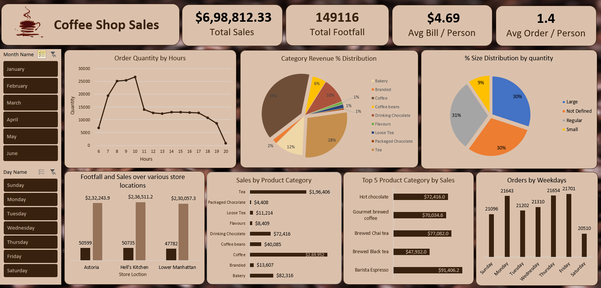

## Coffee Sales Analysis Project

### Project Overview

This project involves analyzing coffee sales data to uncover key trends and insights. The data was sourced from Maven Analytics and processed using Power Query and Power Pivot in Excel. The final output is an interactive dashboard that provides a comprehensive view of sales performance.

### Data Preparation and Transformation

#### Data Extraction
- **Source**: Maven Analytics
- **Tool**: Power Query

#### Data Transformation Steps

1. **Changed Timestamp Format**:
   - Converted timestamps to display only the time.

2. **Created Conditional Column for Size**:
   - Extracted size details (e.g., Small, Medium, Large) from the product details column.

3. **Cleaned Product Details Column**:
   - Removed size abbreviations (Lg, Rg, Sm) from the product details.

4. **Calculated Total Amount**:
   - Added a column to compute the total amount for each transaction.

5. **Extracted Day Name**:
   - Added a column to indicate the day of the week for each transaction.

6. **Extracted Hour of Time**:
   - Added a column to indicate the hour of each transaction.

7. **Extracted Month Name**:
   - Added a column to indicate the month name for each transaction.

#### Data Loading

- Loaded the transformed data into Excel for analysis using Power Pivot.

### Power Pivot Analysis

#### Created Tables for Analysis

1. **Hourly Transactions**:
   - Summarized the total quantity of transactions by hour.

2. **Daily Transactions**:
   - Counted the number of transactions by day.

3. **Monthly Sales**:
   - Summarized the total sales amount by month.

4. **Category Sales**:
   - Summarized the total sales amount by product category.

5. **Top 5 Products by Sales**:
   - Listed the top 5 products by total sales amount.

6. **Top 5 Product Types by Sales**:
   - Listed the top 5 product types by total sales amount.

7. **Store Location Analysis**:
   - Analyzed the count of transactions and total sales amount by store location.

#### Created Measures in Power Pivot

1. **[Total Sales]**:
   - Total sales amount.

2. **[Footfall]**:
   - Total number of transactions.

3. **[Avg_Amount Per Person]**:
   - Average amount spent per person.

4. **[Avg Orders Per Person]**:
   - Average number of orders per person.

### Interactive Dashboard

- **Tool**: Excel using Power Pivot and Slicers
- **Features**:
  - Interactive tables and charts displaying key metrics and insights.
  - Slicers for dynamic filtering

### Repository Link

The Excel workbook and all associated files can be accessed from the following GitHub repository:

[GitHub Repository](https://github.com/yourusername/coffee-sales-analysis)

---

### Key Questions Analyzed

1. **How do sales vary by day of the week and hour of the day?**
   - **Insights**: Sales are highest on Mondays and lowest on Saturdays. The order of sales by day is as follows: Monday > Friday > Thursday > Wednesday > Tuesday > Sunday > Saturday. The highest sales occur between 9 and 10 AM.

2. **What is the total sales revenue for each month?**
   - **Insights**:
     - January: $81,677.74
     - February: $76,145.19
     - March: $98,834.68
     - April: $118,941.08
     - May: $156,727.76
     - June: $166,485.88

3. **How do sales vary across different store locations?**
   - **Insights**:
     - Astoria: $232,243.91
     - Hell's Kitchen: $236,511.17
     - Lower Manhattan: $230,057.25

4. **What is the average price/order per person?**
   - **Insights**: 
     - The average price per person is $4.90.
     - The average number of orders per person is 1.4.

5. **Which products are best-selling in terms of quantity and revenue?**
   - **Insights**: 
     - Coffee accounts for 39% of sales.
     - Tea accounts for 28% of sales.
     - Bakery items account for 12% of sales.
     - Drinking chocolate accounts for 10% of sales.

6. **How do sales vary by product category and type?**
   - **Insights**:
     - Sales are highest for coffee, followed by tea, bakery items, drinking chocolate, coffee beans, flavors, loose tea, and packaged chocolate.
     - The top 5 product types are Barista Espresso, Brewed Chai Tea, Hot Chocolate, Gourmet Coffee, and Brewed Black Tea.

### Conclusion

This coffee sales analysis project provides a detailed overview of sales performance and customer behavior. The interactive dashboard facilitates dynamic exploration of the data, enabling data-driven decision-making to optimize sales strategies and enhance customer satisfaction.

---
