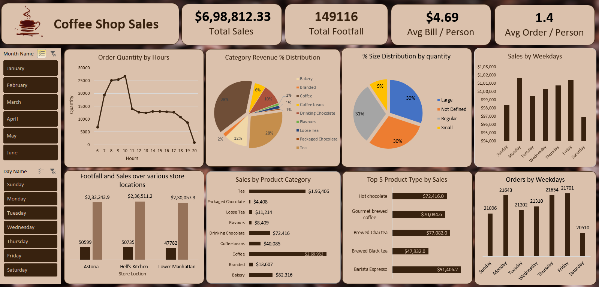

## Coffee Sales Analysis Project

### Project Overview

This project involves analyzing coffee sales data to uncover key trends and insights. The data was sourced from Maven Analytics and processed using Power Query and Power Pivot in Excel. The final output is an interactive dashboard that provides a comprehensive view of sales performance.

### Data Preparation and Transformation

#### Data Extraction
- **Source**: Maven Analytics
- **Tool**: Power Query

#### Data Transformation Steps

- Changed time format
- Added size column
- Cleaned product details
- Calculated total amount
- Added day of week
- Added hour of transaction
- Added month name

#### Data Loading

- Loaded the transformed data into Excel for analysis using Power Pivot.

## Tables Created for Analysis

#### 🕰️ Hourly Transactions
#### 📅 Daily Transactions
#### 📆 Monthly Sales
#### 🛍️ Category Sales
#### 🏆 Top 5 Products Details
#### 🥇 Top 5 Product Types
#### 🏬 Store Location Analysis

## 📊 Created Measures in Power Pivot
#### 💰 Total Sales
#### 👥 Footfall
#### 💸 Avg_Amount Per Person
#### 🛒 Avg Orders Per Person

### Interactive Dashboard

- **Tool**: Excel using Power Pivot and Slicers
- **Features**:
  - Interactive tables and charts displaying key metrics and insights.
  - Slicers for dynamic filtering

### Repository Link

The Excel workbook and all associated files can be accessed from the following GitHub repository:

[Excel Workbook](CoffeeShopSales.xlsx)

---

### Key Questions Analyzed

☕️ Coffee Shop Analysis

📊 Key Insights:

1️⃣ 📅🕰️ Peak sales: Mondays, 9-10 AM
2️⃣ 📆💰 Top month: June
3️⃣ 🏙️ Best location: Hell's Kitchen
4️⃣ 💸 Avg spend: $4.90/person
5️⃣ 🛒 Avg orders: 1.4/person
6️⃣ 🏆 Top products:
   - ☕️ Coffee: 39%
   - 🍵 Tea: 28%
   - 🥐 Bakery: 12%
   - 🍫 Chocolate: 10%
7️⃣ 🥇 Best sellers:
   - Barista Espresso
   - Chai Tea
   - Hot Chocolate
   - Gourmet Coffee
   - Black Tea

Key takeaways from the analysis include:

1. Identifying peak sales times (Mondays, 9-10 AM) allows for optimal staffing and inventory management.
2. Recognizing June as the top-performing month enables seasonal strategy planning.
3. Hell's Kitchen's superior performance suggests potential for replicating its success factors in other locations.
4. The average spend of $4.90 per person and 1.4 orders per person provide benchmarks for upselling strategies.
5. Product category insights (Coffee 39%, Tea 28%, Bakery 12%, Chocolate 10%) inform inventory and menu decisions.
6. Identifying top-selling products helps in focusing marketing efforts and ensuring consistent stock.

These insights can be leveraged to:
- Optimize staffing schedules
- Refine marketing strategies
- Improve inventory management
- Enhance menu offerings
- Develop location-specific strategies

Future steps could include:
- Conducting customer surveys to complement sales data
- Analyzing the impact of promotions and seasonal offerings
- Investigating opportunities for new product introductions based on current preferences
- Exploring potential for new location openings based on successful store models

This project demonstrates the power of data analysis in transforming raw sales data into actionable business intelligence, providing a solid foundation for strategic decision-making in the competitive coffee shop industry.
